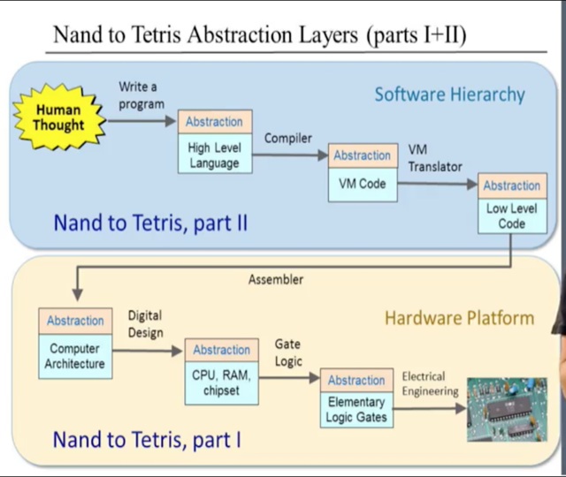

# [From Nand to Tetris](https://www.nand2tetris.org/software)
Building a Modern Computer From First Principles

* Book: [The Elements of Computing Systems](https://mitpress.mit.edu/books/elements-computing-systems)
* Instructors: Shimon Schocken & Noam Nisan

## Overview
This project is from the MOOC course nand2tetris. From building basic elementary logic gates to writing a high level language and operating system, this course will teach me how to build a modern-day, all-purpose PC from the ground up.

By digging deep into the implementations behind the multi-layered abstractions used to create the hardware and software, I hope to reach a higher understanding behind the lower-level processes that make up today's computing world.

## Course Visual Roadmap

## Projects

* Project 0: Introduction 
* [Project 1: Boolean Logic](#project-1-boolean-logic)
* [Project 2: Boolean Arithmetic](#project-2-boolean-arithmetic)
* [Project 3: Sequential Logic](#project-3-memory--sequential-logic)   
* [Project 4: Machine Language](#project-4-machine-language)
* Project 5: Computer Architecture  
* Project 6: Assembler   
* Project 7: VM I: Stack Arithmetic   
* Project 8: VM II: Program Control   
* Project 9: High-Level Language  
* Project 10: Compiler I: Syntax Analysis   
* Project 11: Compiler II: Code Generation   
* Project 12: Operating System 

## Project 1: Boolean Logic
- Used logic and boolean algebra to reduce and simplify the implementation of several elementary logic gates. De Morgan's Laws and Distributive property were particularly useful.

- Started with only a Nand gate but used previously-built chips for chip implementations down the line to avoid redundancy and to simplify complexity.

- Played around with a logic gate simulator to determine inner chip gate links as problems got more complex.

- Implementation of Mux and DMux were the most difficult and required several different try, check, and revise cycles but eventually came to a solution that seems to be close to optimal, if not optimal. 

- Multi-bit elementary gates were the easiest to implement since it is just stacking an array of n elementary gates for an n-bit complex gate.

- Multi-way gates, or multi-input gates, were tricky at first, but easy enough once the pattern showing the relationship between an m-way gate and its normal elementary gate was found. 

## Project 2: Boolean Arithmetic 
- Used chips created in Project 1 in a certain combinatorial pattern to create chips that build into the ALU (focus on arithmetic and addition of 16-bit inputs).

- Half-Adder implementation was trivial, Full-Adder took a little logic and time to solve, 16-bit Adder was also a trivial sequence of Full-Adder chips.

- The most difficult in this project was the ALU. Using Multiplexors, implementing the ALU was simple enough to figure out, however, the status outputs were a hurdle to overcome. 

- Was tricky figuring out how to determine if a number was zero or negative, but realizing 2's complement rules/patterns as well as bitwise checking for true/false bits led to a solution for both.

- Overall, an easier time than Project 1. 

## Project 3: Memory & Sequential Logic
- I enjoyed learning about how memory really works in this chapter and all of the underlying parts and organized hardware that go into making RAM chips and other storage systems.

- Although a good portion of the hardware and functionality was abstracted away, sequential logic was not as difficult to grasp as I imagined it to be.

- All the RAM chips were simple enough to implement by using recursive logic after the first RAM8 chip was complete.

- Was slightly hard to understand how to implement the Program Counter at first but eventually got it.

## Project 4: Machine Language
- I was really excited about learning about the infamous Assembly language even before this course. 

- It is really interesting to learn how Assembly is not a single language, and the Assembly language used in this course is just one of many possible languages that work as the bridge between software and the computer's hardware.

- The Assembly language chosen depends on the computer's architecture, hardware, system capabilities, etc.

- This Hack computer uses a simpler one due to less features in the CPU/ALU, as well as being a 16-bit computer, but it was a good representation/comparison to real Assembly languages used in modern computers. I learned a lot about the theory behind them which is more important than just learning the syntax in my opinion.

- The fact that Assembler's translate all the Assembly code into 1s and 0s is mind boggling and impressive to see how much compilers and transpilers really work to get high-level languages translated into Assembly, and Assembly into binary.

- The Multiplication project was easy, I had the implementation plan layed out in my head prior to starting, but still decided to write pseudo-code for good habit. Nailed it on the first try. 

- The Fill project was a little bit trickier and took a few attempts and slow step-by-step debugging to understand how the program worked and what I was missing in the code. Got it within the first 3-5 trials and felt pretty good with completing this project in less than a day. 